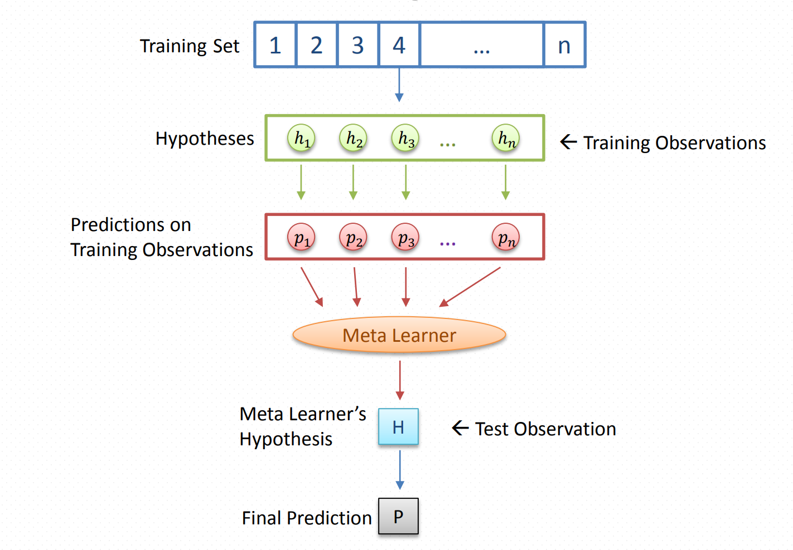

# Stacked Ensemble Learning

### 1. How to combine classifiers
There are two approaches for combining models: voting and stacking
- In voting, label that is most often assigned to a particular instance is chosing as the correct prediction. Let's take a real life example of voting. 
  * In our day to day life, when crucial decisions are made in a meeting, a voting among the members present in the meeting is conducted when the opinions of the members conflict with each other. 
  * This principle of “voting” can be applied to machine learning also. In voting scheme, when classifiers are combined, the class assigned to a test instance will be the one suggested by most of the base level classifiers involved in the ensemble
- In stacking, a second-level learner or meta-learner is trained to combine the first-level learners.

### 2. Stacking framework

- The basic idea is to train the first-level learners (base learners) using the original training data set, and then generate a new data set for training the second-level learner (meta learners), where the outputs of the first-level learners are regarded as input features while the original labels are still regarded as labels of the new training data. 
- The first-level learners are often generated by applying different learning algorithms L1,..., LN.

## FAQ
1. Why do we have to generate a new dataset for the first-level classifiers in the training phase?

If the exact data that are used to train the first-level learner are also used to generate the new data set for training the second-level learner, there will be a high risk of overfitting. Hence, it is suggested that the instances used for generating the new data set are excluded from the training examples for the first-level learners, and a crossvalidation or leave-one-out procedure is often recommended

## Reference
1. http://www2.islab.ntua.gr/attachments/article/86/Ensemble%20methods%20-%20Zhou.pdf
2. https://www3.nd.edu/~rjohns15/cse40647.sp14/www/content/lectures/32%20-%20Stacking.pdf 
3. https://shodhganga.inflibnet.ac.in/bitstream/10603/7989/15/15_chapter%206.pdf 
